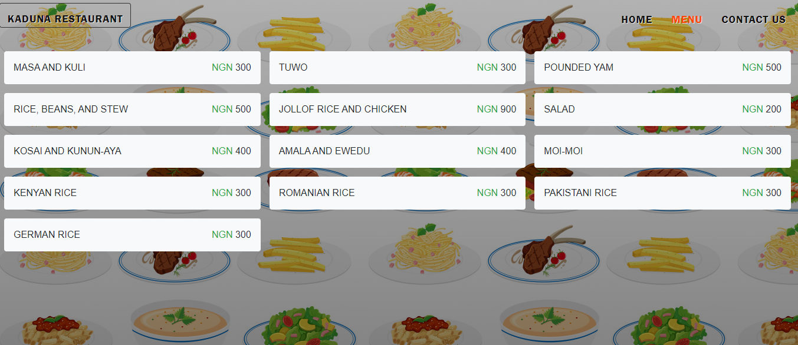

# Project: Restaurant Page

> This project comes after the introduction of the ES6 class keyword, ES6 modules, and webpack. The main goal of this project is for the student to show the understanding of the benefits of modularized code as well as the ability to set up a javascript application made of different modules using webpack.



## Live demo

🔗 [visit the page](https://stupefied-shannon-6eeba9.netlify.app/)

## Built With

- Javascript (ES6)
- HTML / CSS
- Bootstrap 4
- Font awesome icons
- Webpack

## Getting Started

To get a local copy up and running follow these simple steps.

### Prerequisites

In order for ```restaurant``` to work locally on your machine, you need these installations:
- Nodejs and npm
- Web Browser

### Install

1) Open the Terminal
2) Run

```sh
git clone https://github.com/belsman/Restaurant-Page.git
```

or, for SSH:

```sh
git clone git@github.com:belsman/Restaurant-Page.git
```

3) Run ```cd Restaurant-Page``` to enter the main directory
4) Run ```npm install```
5) Run ```npm run build```
6) Run ```cd dist/```
8) Open the ```index.html``` in our browser
9) View page and play with source code!
`

## Author

👤 **Bello Babakolo**

- Github: [@belsman](https://github.com/belsman)
- Twitter: [@d_belsman](https://twitter.com/d_belsman)
- Linkdin: [Bello Babakolo](https://www.linkedin.com/in/bello-babakolo-b23b17145/)


## 🤝 Contributing

Contributions, issues and feature requests are welcome!

Feel free to check the [issues page](issues/).

## Show your support

Give a ⭐️ if you like this project!

## Acknowledgments

- Microverse for showing the way for this project to happen
- [Freepik for the awesome background Image](https://www.freepik.com/free-photos-vectors/food)
